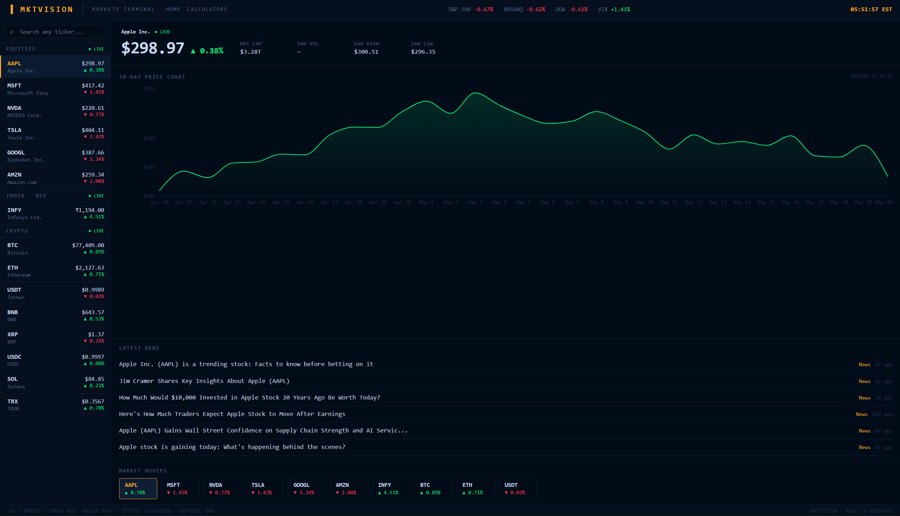

# MktVision — Markets Terminal & Financial Calculators

A Bloomberg-style real-time markets terminal combined with a financial literacy hub. Built with React, deployed on Cloudflare Pages with serverless Workers proxying live financial data.

> **Live:** [mkt-vision.com](https://mkt-vision.com) · **Terminal:** [mkt-vision.com/dashboard](https://mkt-vision.com/dashboard) · **Calculators:** [mkt-vision.com/calculators](https://mkt-vision.com/calculators)



---

## Features

### Homepage
- **Live ticker strip** — S&P 500, NASDAQ 100, BTC, ETH, Gold updating every 60 seconds
- **Rotating finance quotes** — curated quotes from Buffett, Munger, Graham and others

### Markets Terminal
- **Live US equities** — real-time quotes for AAPL, MSFT, NVDA, TSLA, GOOGL, AMZN via Finnhub
- **WebSocket prices** — US stock prices update tick-by-tick during market hours. Rows flash green/red on price change
- **Real historical charts** — 5D, 1M, 3M, 6M, 1Y and custom date range via Polygon.io
- **Live Indian NSE stocks** — top NSE stocks with ₹ prices via Twelve Data
- **Live crypto** — top 8 by market cap with 30-day charts via CoinGecko
- **Live market indices** — S&P 500, NASDAQ, DOW, VIX via ETF proxies
- **Universal search** — search any US ticker or NSE stock in one box
- **Market news** — latest headlines per asset via Bing News RSS
- **Mobile responsive** — tap a stock to see full detail view, back button to return to list
- **Auto-refresh** — all data refreshes every 60 seconds

### Financial Calculators (11 tools)

| Calculator | Description |
|---|---|
| **SIP** | Future value with step-up SIP, expense ratio and lumpsum |
| **EMI** | Loan repayments with yearly amortization breakdown |
| **Compound Interest** | Compare annual, quarterly and monthly compounding |
| **Stock Returns** | P&L, absolute return and CAGR including brokerage |
| **Portfolio Allocator** | Holdings visualisation with pie chart |
| **Options P&L** | Call/put payoff diagram with breakeven and key levels |
| **Net Worth** | Assets vs liabilities with allocation charts |
| **Credit Card** | True cost of carrying a balance — minimum payment trap |
| **Inflation Impact** | Purchasing power decay, goal inflator, everyday items table |
| **FD vs Mutual Fund** | Post-tax, inflation-adjusted comparison with breakeven CAGR |
| **ULIP vs Term + MF** | Why mixing insurance with investment costs you lakhs |

---

## Architecture

```
Browser
   │
   ├── /api/wstoken                      ──▶  Cloudflare Worker  ──▶  (serves Finnhub key securely)
   ├── /api/stocks?symbols=AAPL,MSFT     ──▶  Cloudflare Worker  ──▶  Finnhub REST API
   ├── /api/indices                       ──▶  Cloudflare Worker  ──▶  Finnhub API (ETF proxies)
   ├── /api/indian                        ──▶  Cloudflare Worker  ──▶  Twelve Data API
   ├── /api/search?q=apple                ──▶  Cloudflare Worker  ──▶  Finnhub + Twelve Data
   ├── /api/chart?symbol=AAPL&range=1Y    ──▶  Cloudflare Worker  ──▶  Polygon.io API
   ├── /api/news?symbol=AAPL              ──▶  Cloudflare Worker  ──▶  Bing News RSS / Finnhub
   ├── wss://ws.finnhub.io                ──▶  Direct WebSocket   ──▶  Finnhub WebSocket
   └── CoinGecko API                      ──▶  Direct (no key needed)
```

API keys live exclusively in Cloudflare's environment variables — never shipped in the client bundle.

---

## Tech Stack

| Layer | Technology |
|---|---|
| Frontend | React 18, React Router v6, Recharts |
| Build | Vite |
| Hosting | Cloudflare Pages |
| API proxy | Cloudflare Pages Functions (Workers) |
| US stock data | [Finnhub](https://finnhub.io) (free tier) |
| Real-time prices | [Finnhub WebSocket](https://finnhub.io/docs/api/websocket-trades) |
| Historical charts | [Polygon.io](https://polygon.io) (free tier) |
| Indian NSE data | [Twelve Data](https://twelvedata.com) (free tier) |
| Crypto data | [CoinGecko](https://coingecko.com) (public API) |
| Market news | Bing News RSS |

---

## Security

- **No API keys in the frontend bundle** — all keys are server-side in Cloudflare Workers
- **WebSocket key** — served via `/api/wstoken` Worker at runtime, never hardcoded
- **Origin locking** — Workers reject requests from any domain other than `mkt-vision.com`
- **Input sanitization** — all symbol inputs sanitized and validated before reaching external APIs
- **Server-side caching** — Cloudflare Workers Cache API prevents rate limit abuse
- **Secrets** — keys stored as encrypted Secrets in Cloudflare, never visible after creation

---

## Project Structure

```
├── functions/
│   └── api/
│       ├── stocks.js      # US equity quotes → Finnhub
│       ├── indices.js     # Market indices → Finnhub (ETF proxies)
│       ├── indian.js      # NSE stock quotes → Twelve Data
│       ├── search.js      # Symbol search → Finnhub + Twelve Data
│       ├── chart.js       # Historical OHLC → Polygon.io
│       ├── news.js        # Market news → Bing RSS / Finnhub
│       └── wstoken.js     # Finnhub WebSocket key endpoint
├── src/
│   ├── components/
│   │   ├── Navbar.jsx
│   │   └── ErrorBoundary.jsx
│   ├── pages/
│   │   ├── Home.jsx
│   │   ├── Dashboard.jsx
│   │   ├── CalculatorsHub.jsx
│   │   └── calculators/
│   │       ├── SIP.jsx
│   │       ├── EMI.jsx
│   │       ├── Compound.jsx
│   │       ├── StockReturn.jsx
│   │       ├── Portfolio.jsx
│   │       ├── Options.jsx
│   │       ├── NetWorth.jsx
│   │       ├── CreditCard.jsx
│   │       ├── Inflation.jsx
│   │       ├── FDvsMF.jsx
│   │       └── ULIPvsTermMF.jsx
│   ├── App.jsx
│   ├── FinanceDashboard.jsx
│   └── main.jsx
├── public/
│   └── favicon.ico
├── index.html
├── package.json
└── vite.config.js
```

---

## Getting Started

### Prerequisites

- [Node.js](https://nodejs.org) 18+
- A [Cloudflare](https://cloudflare.com) account (free)
- A [Finnhub](https://finnhub.io) API key (free)
- A [Twelve Data](https://twelvedata.com) API key (free)
- A [Polygon.io](https://polygon.io) API key (free)

### Local development

```bash
git clone https://github.com/evans-0/finance
cd finance
npm install
npm run dev
```

### Deployment

1. Push to GitHub
2. Connect repo to [Cloudflare Pages](https://pages.cloudflare.com)
3. Build command: `npm run build` · Output directory: `dist`
4. Add environment variables under **Settings → Environment Variables**:

| Variable | Type | Value |
|---|---|---|
| `FINNHUB_KEY` | Secret | Your Finnhub API key |
| `TWELVEDATA_KEY` | Secret | Your Twelve Data API key |
| `POLYGON_KEY` | Secret | Your Polygon.io API key |
| `ALLOWED_ORIGIN` | Plaintext | `https://mkt-vision.com` |

5. Redeploy — Cloudflare auto-deploys on every `git push`

---

## Known Limitations

- **NSE historical charts** — Twelve Data free tier doesn't include historical OHLC. NSE charts use a simulated price path from the current live price.
- **NSE search coverage** — Twelve Data free tier covers major NSE stocks. Less liquid tickers may not be available.
- **Indian stock refresh rate** — NSE prices update every 15 minutes to stay within Twelve Data's 800 credits/day free tier limit.
- **Index absolute values** — Finnhub free tier returns zero for `^GSPC` etc. ETF proxies (SPY/QQQ/DIA) show accurate percentage change only.
- **Polygon.io rate limit** — free tier allows 5 API calls/minute. Chart requests are debounced and cached to stay within limits.
- **WebSocket market hours** — Finnhub WebSocket only streams during US market hours (9:30 AM–4 PM ET / 7 PM–1:30 AM IST).

---

## License

MIT
